## หลักการทำงานของ Project
# จากภาพ การทำงานของ workflow  หลักๆ  มีการเทสที่ก่อนการ buildimage ด้วย github action ขึ้น github container  registry เมื่อ ทำ ci เสร็จจะ  trigger webhook ไปยัง jebkins ให้ดึง  image จากตัว  ginhub container registry มา deploy ลงใน jenkins vm ในส่วนของ cd 

1.การทำงานใส่ส่วนของ ci  อย่างแรกของ โจทย์ข้อ 2  นั้นต้องมีการ setup เพื่อให้ github action ดังภาพ 
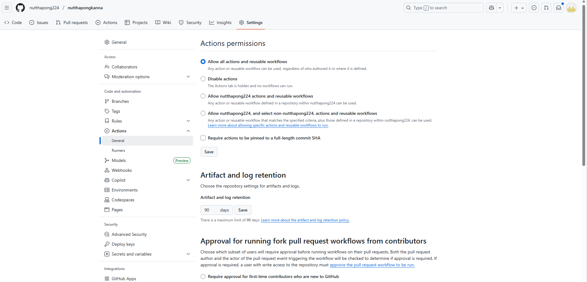

2.

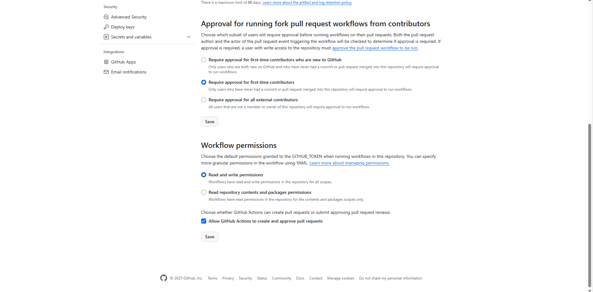

3.
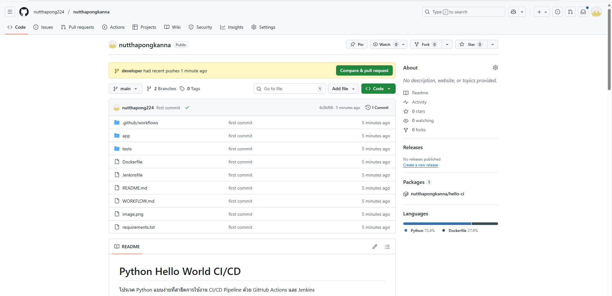

4.
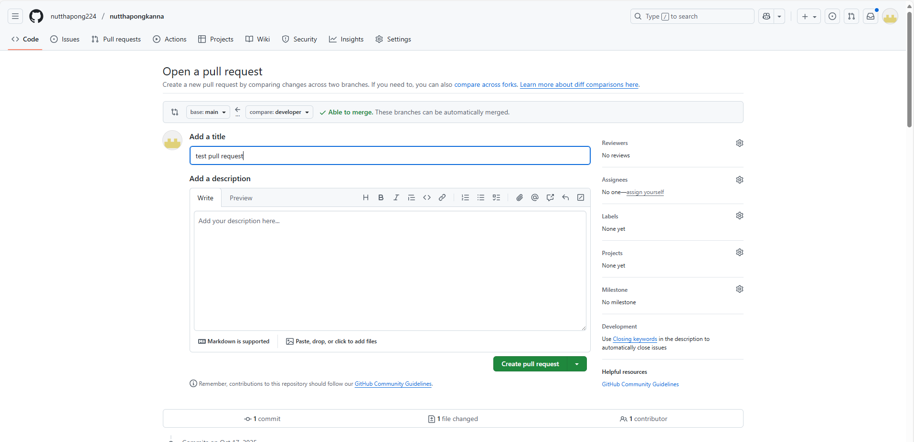

5. ดังในข้อกำหนด ข้อสอง มีการ install package ผ่าน requirements.txt แล้ว เมื่อเทสผ่าน แสดง สถานะ
✅ success

6. ในเคสที่เทสไม่ผ่านจะแสดง สถานะ ❌ failed” และ merge ไม่ได้ ไม่ได้ ดังภาพ

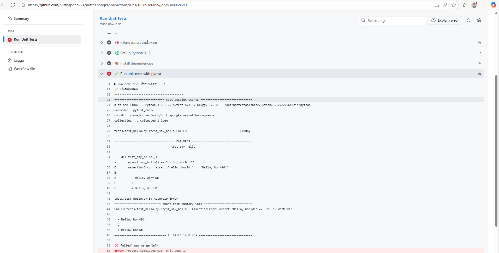
ส่วน แสดงผล “ Passed” ในหน้ํา PR/MR ไม่สามารถทำได้ใน github action ไม่สามารถแก้ข้อความที่ขึ้น  fail หรือ success ได้ เพราะมีคำ defualt ของ github action

7.ดังข้อกำหนดที่  3  เมื่อเรา push code  ขึ้น  branch main จะมีการ   build  image ใน .github/workflow ไฟล์ docker-build.yml ในการทำงานหลักๆ คือ build image และ push image github conatianer resgistry เมื่อผ่านจะมะเป็นดังภาพ
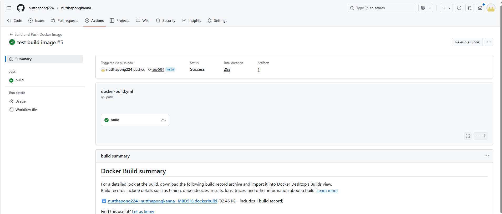

8.เมื่อรันเสร็จให้ไปเปิดที่ package จะเห็น image  ที่เราสร้างมา 

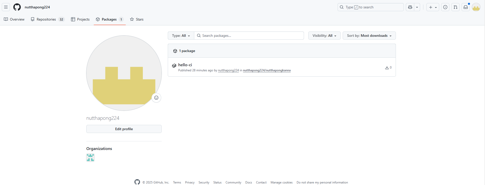

9.เมื่อกดเข้าไปเราจะเห็น image ที่เราสามารถ pull มาใช้่งานได้

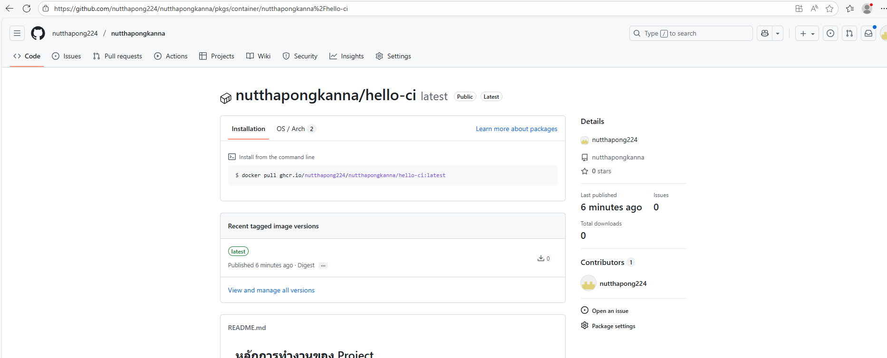

10. ขั้นตอนต่อเซ็พอัพ การทำงาน ของตัว   webhook ร่วมกับ  ตัว jenkins อย่างเราเรา setup pipeline ก่อน
ขั้นตอนการติดตั้งสามารถติดตั้งตาม Medium  ได้เลยเนื่องจากใช้ ubuntu aws เหมือนกัน

[ไปยัง Medium](https://medium.com/@nutthapong.ka1998/%E0%B8%84%E0%B8%B9%E0%B9%88%E0%B8%A1%E0%B8%B7%E0%B8%AD%E0%B8%81%E0%B8%B2%E0%B8%A3%E0%B8%95%E0%B8%B4%E0%B8%94%E0%B8%95%E0%B8%B1%E0%B9%89%E0%B8%87-docker-%E0%B8%81%E0%B8%B1%E0%B8%9A-jenkins-%E0%B9%83%E0%B8%99-ubuntu-24-04-%E0%B9%83%E0%B8%AB%E0%B9%89-jenkins-%E0%B8%AA%E0%B8%B2%E0%B8%A1%E0%B8%B2%E0%B8%A3%E0%B8%96%E0%B9%83%E0%B8%8A%E0%B9%89-docker-%E0%B9%84%E0%B8%94%E0%B9%89%E0%B9%83%E0%B8%99-aws-ec2-45dc61a897b7)

เมื่อติดตั้งjenkins พร้อม setup docker สำเร็จ สิ่งแรกที่เราจะทำคือการ setup pipelin

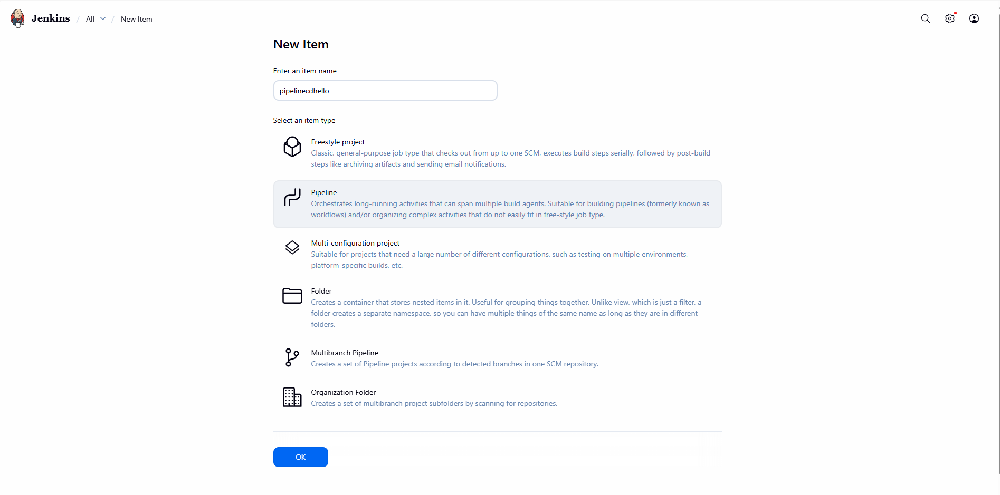

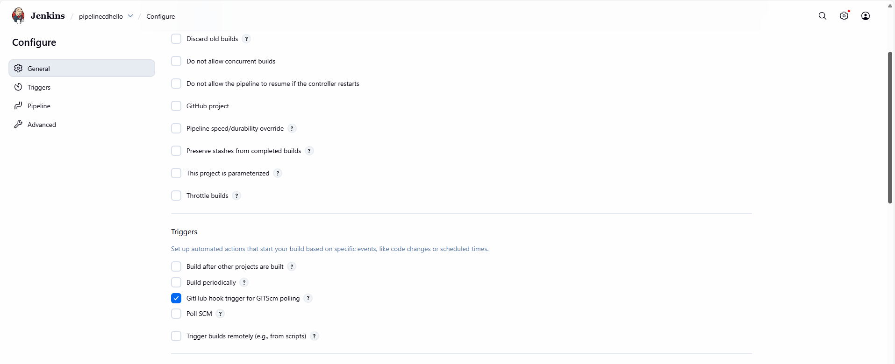

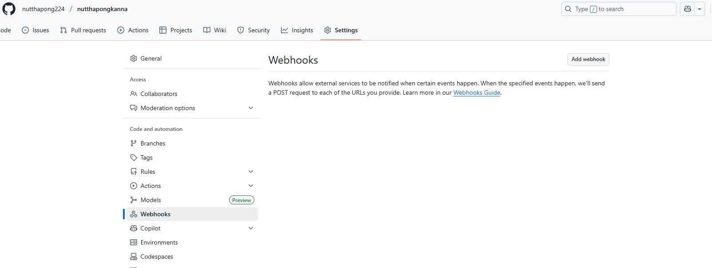

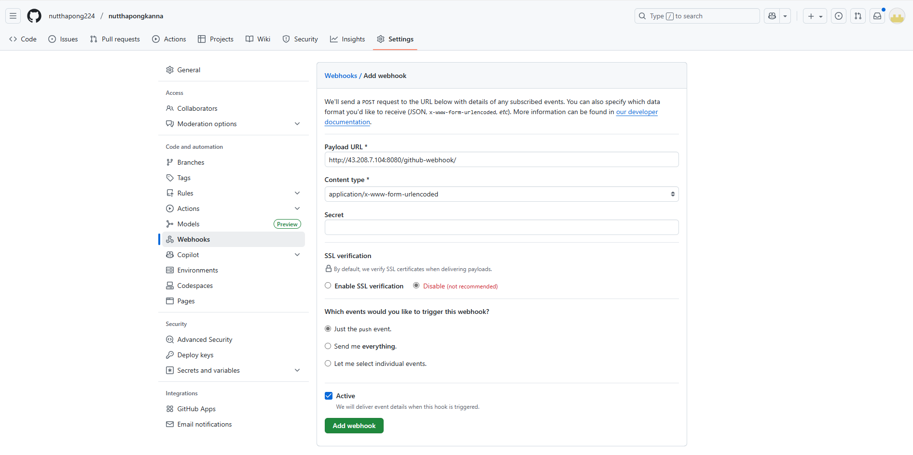

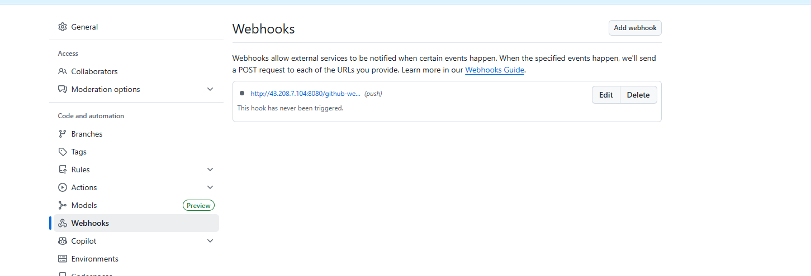
