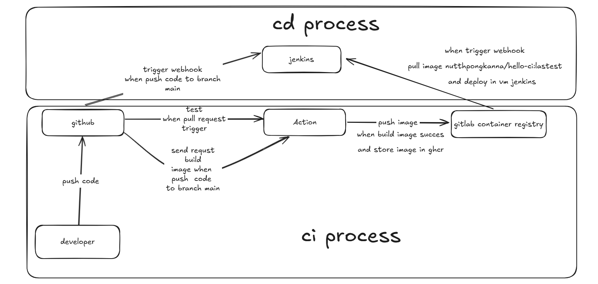
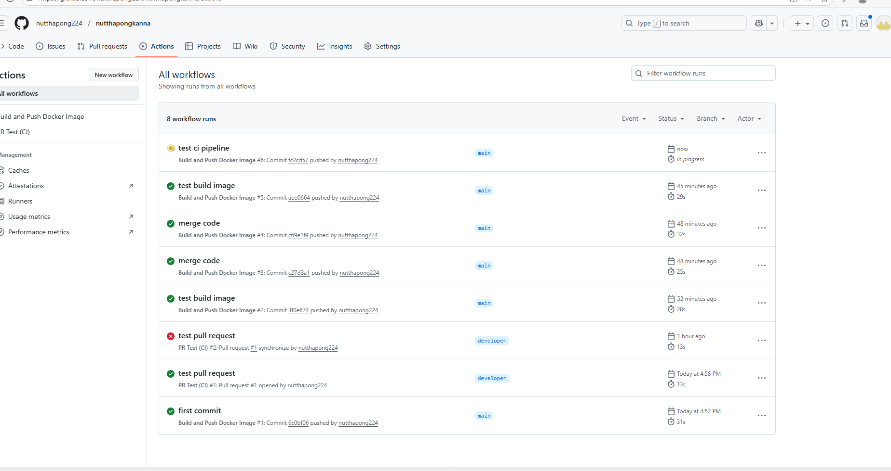
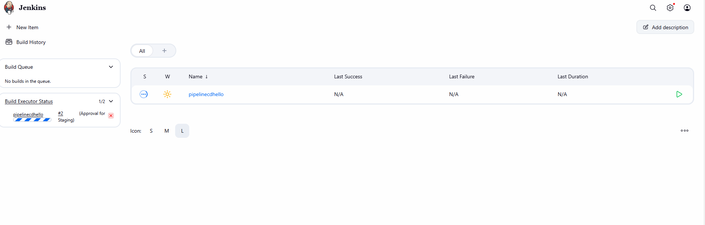
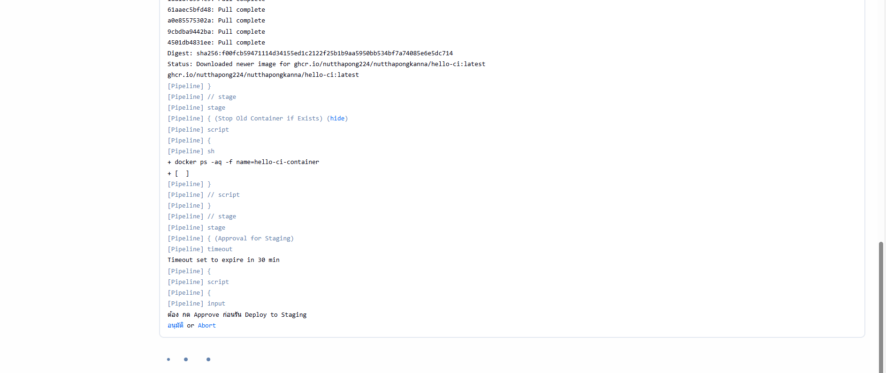
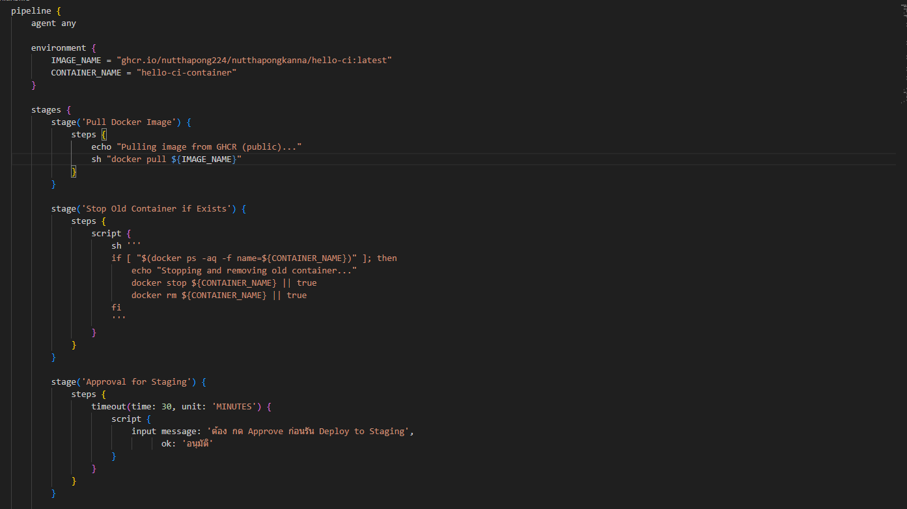
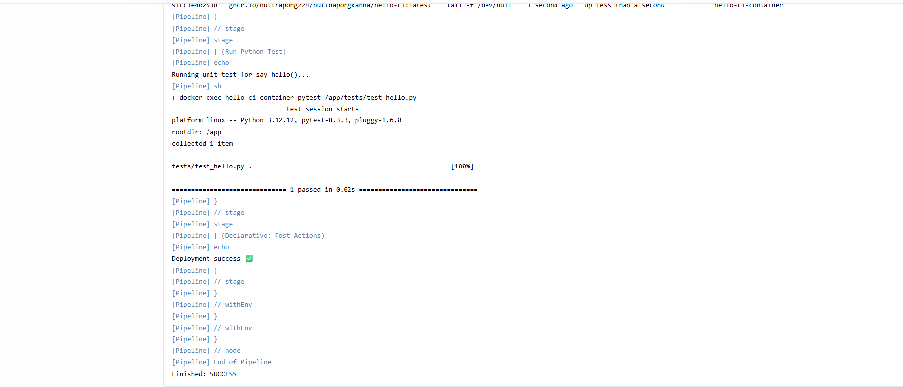
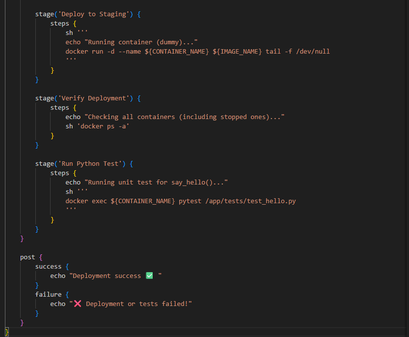

# Python Hello World CI/CD

โปรเจค Python แบบง่ายที่สาธิตการใช้งาน CI/CD Pipeline ด้วย GitHub Actions และ Jenkins

## หลักการทำงาน (Workflow)



1.  **Continuous Integration (CI)**: เมื่อมีการเปิด Pull Request (PR) หรือ push code ไปยัง `main` branch, GitHub Actions จะทำงานอัตโนมัติเพื่อ:
    *   ติดตั้ง Dependencies
    *   รัน Pytest
    *   (สำหรับ `main` branch) Build Docker image และ push ไปยัง GitHub Container Registry (GHCR)
2.  **Continuous Deployment (CD)**:
    *   GitHub Actions จะส่ง Webhook ไปยัง Jenkins เมื่อ CI สำเร็จ
    *   Jenkins จะดึง Docker image ล่าสุดจาก GHCR
    *   Pipeline ใน Jenkins จะรอการ **อนุมัติ (Manual Approval)** ก่อน Deploy
    *   เมื่อได้รับการอนุมัติ, Jenkins จะ Deploy แอปพลิเคชันลงบน VM และแสดงข้อความ "Deployment success ✅"

---

## 📋 สิ่งที่ต้องเตรียม (Prerequisites)

- Python 3.12+
- pip (Python package manager)
- Docker
- Jenkins

---

## 🚀 การติดตั้ง (Installation)

1.  **Clone repository**
    ```bash
    git clone https://github.com/nutthapong224/nutthapongkanna.git
    cd nutthapongkanna
    ```

2.  **ติดตั้ง dependencies**
    ```bash
    pip install -r requirements.txt
    ```

---

## 💻 การใช้งาน (Usage)

### รันแอปพลิเคชัน (Run Application)

```bash
python app/hello.py
```

### รัน Pytest (Run Pytest)

```bash
pytest -v
```

---

## 📝 ส่วนที่ 1: การสร้างสคริปต์พื้นฐาน (Core Scripts)

1.  **สร้างสคริปต์ Python**
    *   **ไฟล์:** `app/hello.py`
    *   **หน้าที่:** `print("Hello, World!")`
2.  **สร้าง Pytest Test**
    *   **ไฟล์:** `tests/test_hello.py`
    *   **หน้าที่:** สร้าง Test Case อย่างน้อย 1 เคสสำหรับ `hello.py` โดยใช้ `pytest`.

---

## 📁 โครงสร้างโปรเจค (Project Structure)

```
.
├── Dockerfile                  # Docker image configuration
├── Jenkinsfile                 # Jenkins pipeline definition
├── README.md                   # เอกสารโปรเจค
├── requirements.txt            # Python dependencies
├── app/
│   ├── hello.py               # Application code
│   └── __init__.py            # Package initializer
├── .github/
│   └── workflows/
│       ├── ci.yml             # CI workflow (Tests on PR)
│       └── docker-build.yml   # Docker build workflow (Build on push to main)
└── tests/
    └── test_hello.py          # Pytest
```

### คำอธิบายไฟล์สำคัญ

| ไฟล์/โฟลเดอร์ | คำอธิบาย |
|---|---|
| `Dockerfile` | กำหนดค่าสำหรับสร้าง Docker image |
| `Jenkinsfile` | กำหนด pipeline สำหรับ Jenkins |
| `requirements.txt` | รายการ Python packages ที่ใช้ในโปรเจค |
| `app/hello.py` | Source code หลักของแอปพลิเคชัน |
| `.github/workflows/` | เก็บไฟล์ GitHub Actions workflows |
| `tests/test_hello.py` | Pytest สำหรับทดสอบฟังก์ชัน |

---

## ⚙️ ขั้นตอนการตั้งค่า CI/CD (CI/CD Setup)

### ส่วนที่ 2: ตั้งค่า CI ใน GitHub Actions (Pull Request Workflow)

ส่วนนี้จะทำให้ระบบรัน test อัตโนมัติเมื่อมีการเปิด Pull Request (PR).

1.  **ตั้งค่า Permissions ใน Repository**:
    *   ไปที่ `Settings` > `Actions` > `General`
    *   ในส่วน `Workflow permissions`, เลือก `Read and write permissions` และติ๊ก `Allow GitHub Actions to create and approve pull requests`.
    
    

2.  **การทำงานของ Workflow**:
    *   เมื่อมีการเปิด PR, GitHub Actions จะเริ่มทำงานตามที่กำหนดในไฟล์ `.github/workflows/ci.yml`.
    
    
    *   Workflow จะทำการติดตั้ง dependencies และรัน Pytest.
    *   **ผลลัพธ์**:
        *   **Test ผ่าน**: จะแสดงสถานะ "success" ✅.
          
        *   **Test ไม่ผ่าน**: จะแสดงสถานะ "failed" ❌ และจะป้องกันไม่ให้ merge PR.
          

### ส่วนที่ 3: Build Docker Image (Push to `main` Workflow)

ส่วนนี้จะทำการ build Docker image และ push ไปยัง GitHub Container Registry (GHCR) โดยอัตโนมัติเมื่อมีการ push code เข้า `main` branch.

1.  **Dockerfile**: ต้องมีการสร้าง `Dockerfile` ที่สามารถ build image ได้สำเร็จ.

2.  **การทำงานของ Workflow**:
    *   เมื่อมีการ push ไปยัง `main` branch, GitHub Actions จะทำงานตามไฟล์ `.github/workflows/docker-build.yml`.
    *   Workflow จะ build image และ push ไปยัง GHCR โดยใช้ชื่อ `ghcr.io/your-username/your-repo-name:latest`.
    

3.  **ตรวจสอบ Image ที่ GHCR**:
    *   หลังจาก workflow ทำงานเสร็จ, image จะปรากฏในหน้า `Packages` ของ repository.
    
    *   คุณสามารถดึง (pull) image นี้ไปใช้งานได้.
    

### ส่วนที่ 4: ตั้งค่า CD ใน Jenkins (Deployment Workflow)

ส่วนนี้จะใช้ Jenkins ในการ deploy แอปพลิเคชันจาก Docker image ที่อยู่ใน GHCR.

1.  **ติดตั้ง Jenkins และ Docker**:
    *   สามารถติดตั้งตามคู่มือนี้: [ติดตั้ง Docker และ Jenkins ใน Ubuntu 24.04](https://medium.com/@nutthapong.ka1998/%E0%B8%84%E0%B8%B9%E0%B9%88%E0%B8%A1%E0%B8%B7%E0%B8%AD%E0%B8%81%E0%B8%B2%E0%B8%A3%E0%B8%95%E0%B8%B4%E0%B8%94%E0%B8%95%E0%B8%B1%E0%B9%89%E0%B8%87-docker-%E0%B8%81%E0%B8%B1%E0%B8%9A-jenkins-%E0%B9%83%E0%B8%99-ubuntu-24-04-%E0%B9%83%E0%B8%AB%E0%B9%89-jenkins-%E0%B8%AA%E0%B8%B2%E0%B8%A1%E0%B8%B2%E0%B8%A3%E0%B8%96%E0%B9%83%E0%B8%8A%E0%B9%89-docker-%E0%B9%84%E0%B8%94%E0%B9%89%E0%B9%83%E0%B8%99-aws-ec2-45dc61a897b7)

2.  **ตั้งค่า Webhook ใน GitHub**:
    *   ไปที่ `Settings` > `Webhooks` > `Add webhook`.
    *   ตั้งค่า `Payload URL` เป็น `http://<your-jenkins-ip>:8080/github-webhook/`.
    *   เลือก `Content type` เป็น `application/x-www-form-urlencoded`.
    *   เลือก `Just the push event`.
    
    
    

3.  **สร้าง Jenkins Pipeline**:
    *   สร้าง Pipeline project ใหม่ใน Jenkins.
    
    *   ในส่วน `Build Triggers`, เลือก `GitHub hook trigger for GITScm polling`.
    
    *   ในส่วน `Pipeline`, เลือก `Pipeline script from SCM` และกำหนดค่า repository และ `Jenkinsfile` ที่ Branch `main`.
    

4.  **การทำงานของ Jenkins Pipeline**:
    *   เมื่อมีการ push ไปยัง `main` branch, GitHub จะ build image (ตามส่วนที่ 2) และส่ง webhook ไปยัง Jenkins.
    
    
    *   Jenkins pipeline จะเริ่มทำงาน:
        1.  ดึง Docker image ล่าสุดจาก GHCR.
        2.  **หยุดรอการอนุมัติ (Manual Approval)**.
            
            
        3.  เมื่อกด "Proceed", Jenkins จะทำการ deploy container.
        4.  เมื่อ deploy สำเร็จ, จะแสดงข้อความ "Deployment success ✅".
            
            
