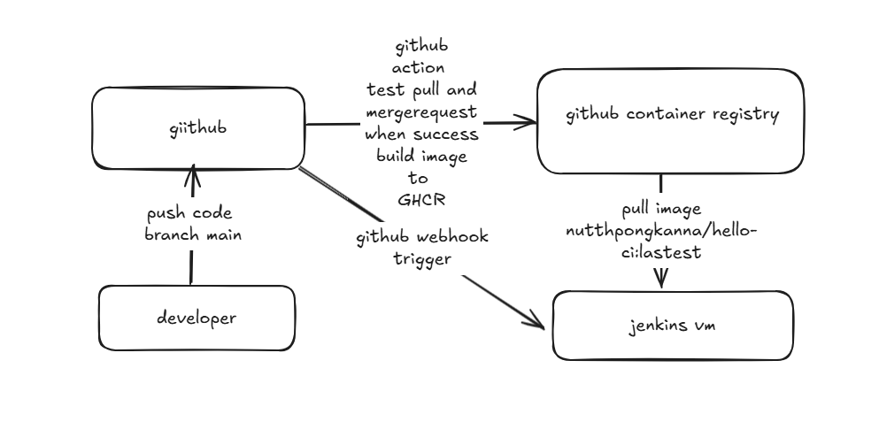

## หลักการทำงานของ Project
# จากภาพ การทำงานของ workflow  หลักๆ  มีการเทสที่ก่อนการ buildimage ด้วย github action ขึ้น github container  registry เมื่อ ทำ ci เสร็จจะ  trigger webhook ไปยัง jebkins ให้ดึง  image จากตัว  ginhub container registry มา deploy ลงใน jenkins vm ในส่วนของ cd 

1.การทำงานใส่ส่วนของ ci  อย่างแรกของ โจทย์ข้อ 2  นั้นต้องมีการ setup เพื่อให้ github action ดังภาพ 
